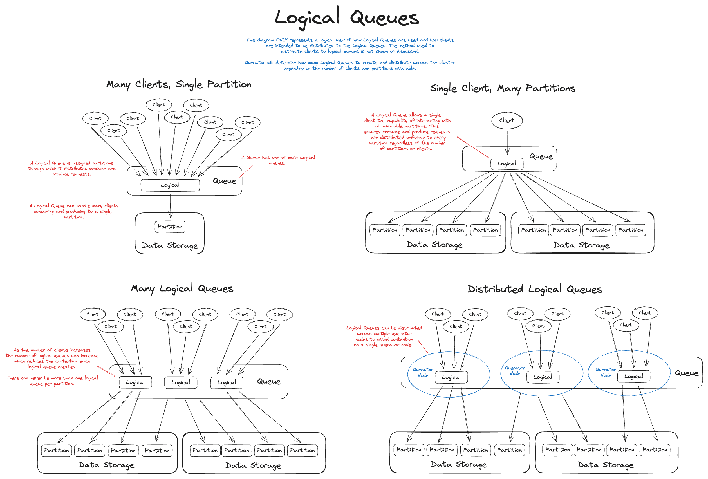

# Architecture Overview

Querator enables API users to interact with queues created by the user, where
each queue can consist of one or more partitions. Each partition is backed by a
single table, collection, or bucket provided by the chosen backend storage.

Partitions are a fundamental component of Querator, enabling the system to
scale horizontally and handle high volumes of data efficiently.

## Core Architectural Components

### Partitions: The Foundation of Scalability

Partitions provide the following benefits:

#### Scalability
Partitions allow a single queue to be distributed across multiple Querator
instances in a cluster. This distribution prevents any single instance from
being overwhelmed by data volume, enabling the system to manage larger data
volumes than a single server could handle. By dividing a queue into multiple
partitions, Querator can scale beyond the limits of a single machine, making it
suitable for large-scale distributed systems.

#### Parallel Distribution
Partitions serve as units of parallelism, allowing multiple consumer instances
to process different partitions concurrently. This significantly increases
overall processing throughput. Unlike some legacy streaming and queuing
platforms, clients are not assigned specific partitions. Instead, clients
interact with Querator endpoints, which automatically distribute producers and
consumers requests across partitions as needed. This automation eliminates the
need for operators to manage the number of consumers per partition to achieve
even work distribution.

For example, if there are 100 partitions and only one consumer, the single
consumer will receive items from all 100 partitions in a round-robin fashion as
they become available. As the number of consumers increases, Querator
automatically adjusts and rebalances the consumers to partitions to ensure even
distribution, even if the number of consumers exceeds the total number of
partitions. This is achieved through "Logical Queues," which dynamically grow
and shrink based on the number of consumers and available partitions.

### Distributed Logical Queues

Logical Queues are made up of many partitions, those partitions are
organized into logical queues depending on the number of consumers registered.
This system uses Raft leader election to choose a coordinator. The coordinator
will rebalance and assign logical queues for each queue group. Coordinators are
distributed amongst all the Querator instances by the leader.

> NOTE: Distributed functionality is planned, but not yet implemented

#### Dynamic Scaling Operations
The Logical Queue and Partition design allows queues dynamically to sale up and
down as needed.

It also allows zero downtime maintenance of the underlying store system. As
Querator is designed to drain partitions off storage systems that are marked as
"readonly" until they can safely be shutdown or updated. This allows users to 
increase queue throughput without sacrificing availability.

It also means that storage or network failures to underlying store does not 
constitute downtime for Querator, as it can safely ignore the degraded storage
system until it recovers.

### Disaggregated Storage Backends

Each partition is supported by a user-selected database backend. This
separation of storage from processing gives operators the flexibility to choose
the desired level of fault tolerance for their specific deployment, and allows
them to use a database they are already familiar with in terms of operation
and scaling. Each partition is backed by a single table, collection, or bucket
(depending on the backend database), making it easy to add or remove partitions as
throughput requirements change or as items are drained from the partition
backends.

Unlike similar queue systems, Querator manages the complexity of partitioning
and balancing on the server side, simplifying the client API. This design
choice makes it easy to integrate Querator with third-party systems,
frameworks, and languages, fostering a rich open-source ecosystem.

The only requirement for databases is support for ordered primary keys. With
just this requirement, Querator can work with any database that implements the
storage backend interface. Support for transactions and secondary indexes is
not required, but can be used to improve Querator's reliability and
performance.

